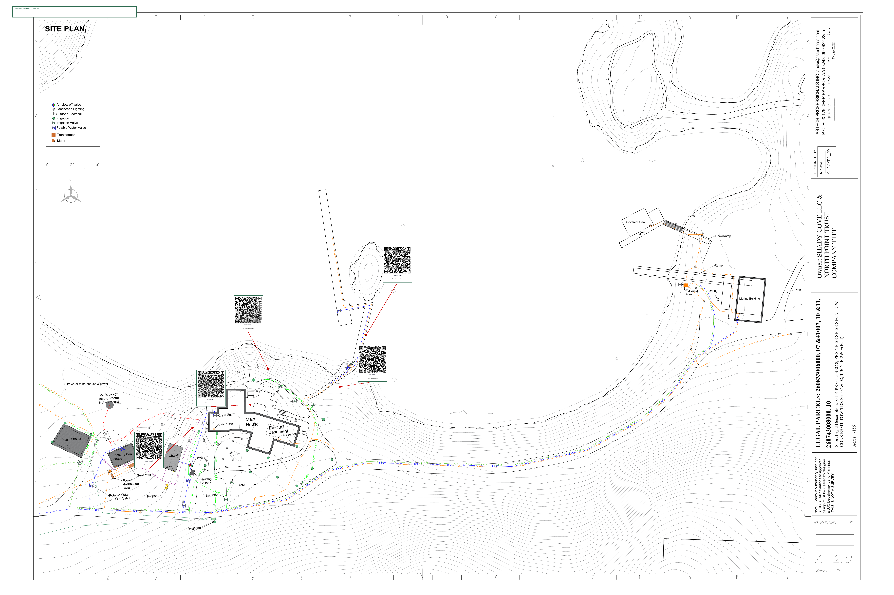
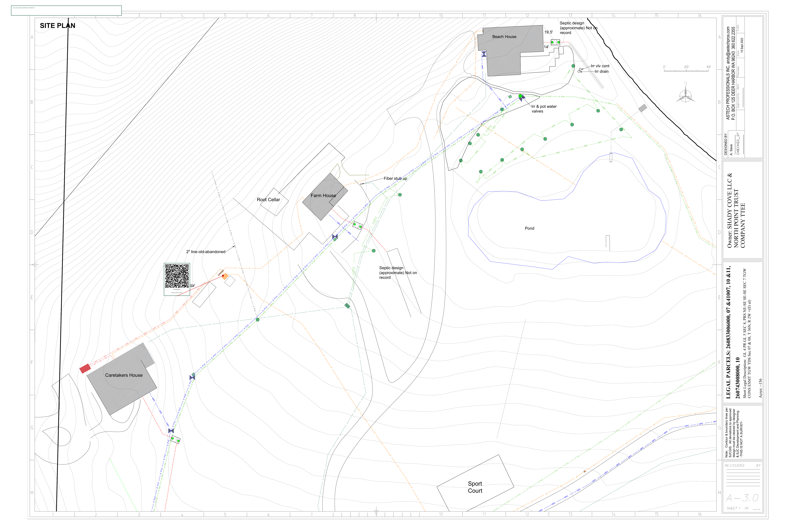

# Shady Cove Property Manual — QR Code System (Proof of Concept)

This document summarizes the proof-of-concept QR code system for the Shady Cove property manual. The system provides instant access to relevant documentation by scanning a QR code at key locations.

## 1. QR Code Labels

The following QR code labels are ready to be printed on weatherproof label paper (e.g., Avery 60501). Each label links directly to the relevant section of the online property manual.

| Location | Description | QR Code Label |
| :--- | :--- | :--- |
| Camp Kitchen | Generator Switchover |  |
| Camp Kitchen | Utilities & Systems |  |
| Main House | Electrical Panel |  |
| Main House | Water Shutoff |  |
| Pump Shed | Water System |  |
| Genset Shed | Backup Power |  |

## 2. Annotated Site Plans

The following site plans have been annotated with QR codes to provide a high-level overview of the system. These are designed to be printed in large format (e.g., 24" x 36") and posted in key locations like the Main House, Camp Kitchen, and Upper Shop.

### SCpg2: Main House & Utilities

This map shows the Main House, Camp Kitchen, Pump Shed, and surrounding utilities. QR codes are placed to point to the electrical panel, water shutoff, generator, and more.

*A print-ready PDF version is available: [SCpg2-annotated.pdf](./SCpg2-annotated.pdf)*

### SCpg3: Secondary Structures

This map shows the Genset Shed and other secondary structures. A QR code is placed to provide information about the backup power system.

*A print-ready PDF version is available: [SCpg3-annotated.pdf](./SCpg3-annotated.pdf)*

## 3. Printing & Installation Instructions

### Printing Labels

1.  **Paper**: Use a full-sheet weatherproof label paper (e.g., Avery 60501 WeatherProof Labels, 8.5" x 11").
2.  **Printing**: Open each QR code PNG file from the `qr-codes` directory and print it. You can arrange multiple labels on a single sheet using any image editing or word processing software.
3.  **Cut**: Carefully cut out each label, leaving a small margin around the border.

### Printing Maps

1.  **File**: Use the `SCpg2-annotated.pdf` and `SCpg3-annotated.pdf` files for printing.
2.  **Size**: For best results, print these on a large format printer at a size of 24" x 36" or larger.
3.  **Lamination**: It is highly recommended to laminate the maps to protect them from the elements.

### Installation

1.  **Labels**: Apply the weatherproof labels directly to or next to the corresponding equipment. Ensure the surface is clean and dry before applying.
    *   **Camp Kitchen Genset**: On the generator control panel or transfer switch.
    *   **Camp Kitchen Utility Room**: Near the main electrical panel or water heater.
    *   **Main House Electrical Panel**: On the door of the main electrical panel.
    *   **Main House Water Shutoff**: On a post or marker near the shutoff valve cover.
    *   **Pump Shed**: Inside the pump shed, near the main control panel.
    *   **Genset Shed**: On the generator itself or the main transfer switch.
2.  **Maps**: Post the large-format laminated maps in central, accessible locations such as:
    *   Inside the Main House utility room.
    *   Inside the Camp Kitchen.
    *   Inside the Upper Shop.

## 4. GitHub Repository

All generated files (QR codes, annotated maps, and this summary) are located in the `/qr-codes/` directory of the `property-manual` GitHub repository. A `gh-pages` branch has also been created with a static HTML version of the manual, which will be available at `https://joe5955.github.io/property-manual/` once GitHub Pages is enabled for the repository.
